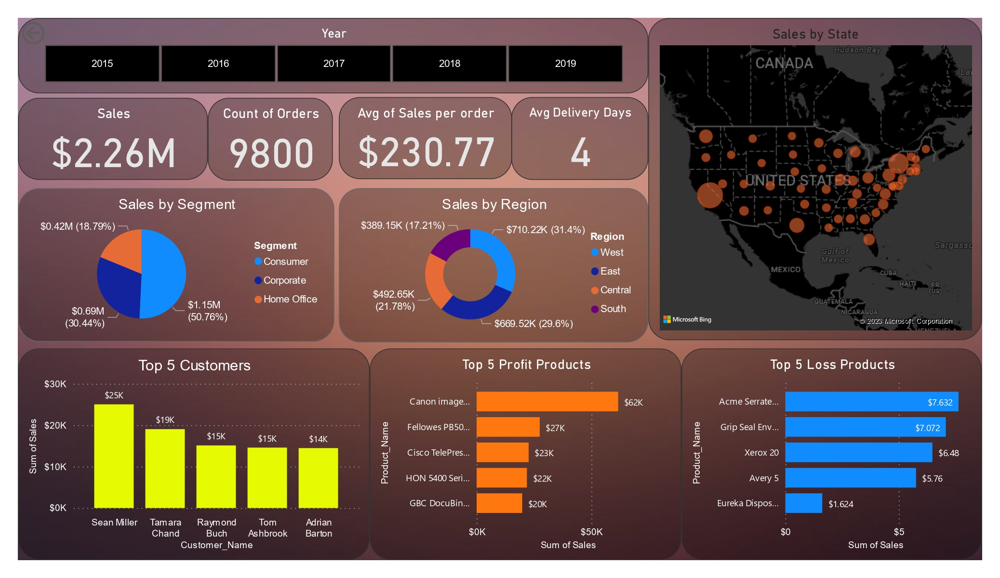

# 📊 Superstore Sales Analysis Dashboard (Power BI)

This project is a **Power BI Superstore Sales Analysis Dashboard** focused on understanding large-scale retail sales performance, customer segments, product trends, and regional contributions.

The dashboard supports **data-driven decision-making** by providing insights into revenue growth, customer behavior, and regional sales performance.

---

## 🚀 Key Features

- **KPIs Overview**
  - **Total Sales**: $2.26M
  - **Total Orders**: 9,800
  - **Average Sales per Order**: $230.77
  - **Average Delivery Days**: 4

- **Time-based Analysis**
  - Year-wise sales trend (2015–2019)
  - Growth pattern across multiple years

- **Product Performance**
  - Top 5 profitable products
  - Top 5 loss-generating products

- **Customer & Segment Analysis**
  - Sales by segment: Consumer, Corporate, Home Office
  - Top customers by revenue contribution

- **Regional Analysis**
  - Sales by region: West, East, Central, South
  - Regional contribution to total revenue

---

## 📸 Dashboard Preview

---

## 🛠 Tools & Technologies

- **Power BI Desktop** – Data cleaning, DAX measures, visualization
- **Retail Sales Dataset (Superstore)** – Transaction-level sales data

---

## 📈 Insights

- The West region contributes the highest share of total sales.
- The Consumer segment dominates overall revenue.
- Sales show a consistent upward trend over multiple years.
- A few products generate recurring losses, indicating optimization opportunities.
- Customer concentration significantly impacts total revenue.

---

## 🎯 Conclusion

This dashboard helps businesses to:
- Monitor **sales growth and trends**
- Analyze **customer segment behavior**
- Identify **regional strengths and weaknesses**
- Optimize **product and pricing strategies**

---

## 👤 Author

**Aniket Yadav**

- **LinkedIn**: https://www.linkedin.com/in/aniket-yadav-/
- **Email**: aniket.analytics1210@gmail.com

⭐ Feel free to explore, fork, or star the repository!
